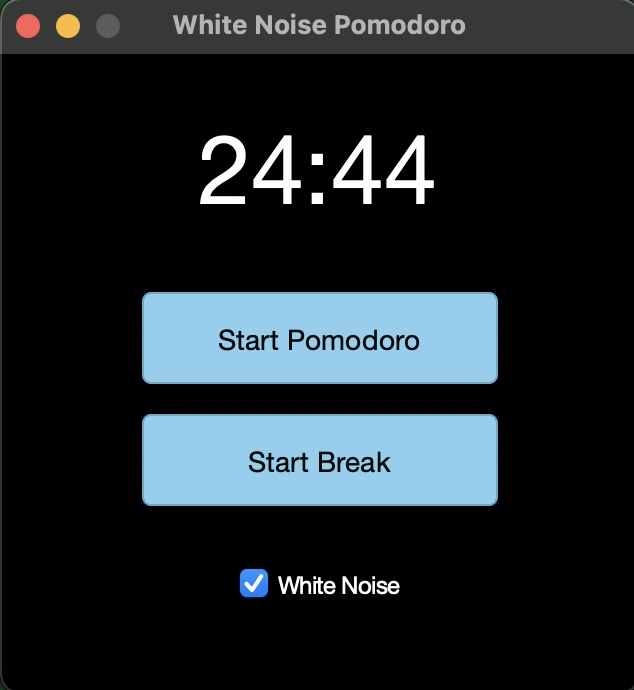

# Pomodoro timer with white noise

## What is it?

This is a simple timer that plays white noise for 25 minutes then "dings" at the end. I time my breaks, so included a 5 minute timer for that (no white noise). Sometimes, I don't want white noise, so I included an on/off toggle. Similar timers will auto-play the break, but I find that feature annoying.   

## Why did I make it?

Mainly for practice. I vibe-coded it with GitHub Copilot then made my own adjustments. 

But also:

1. I like using pomodoro timers while I work
2. I like working with white noise

## What does it look like? 

